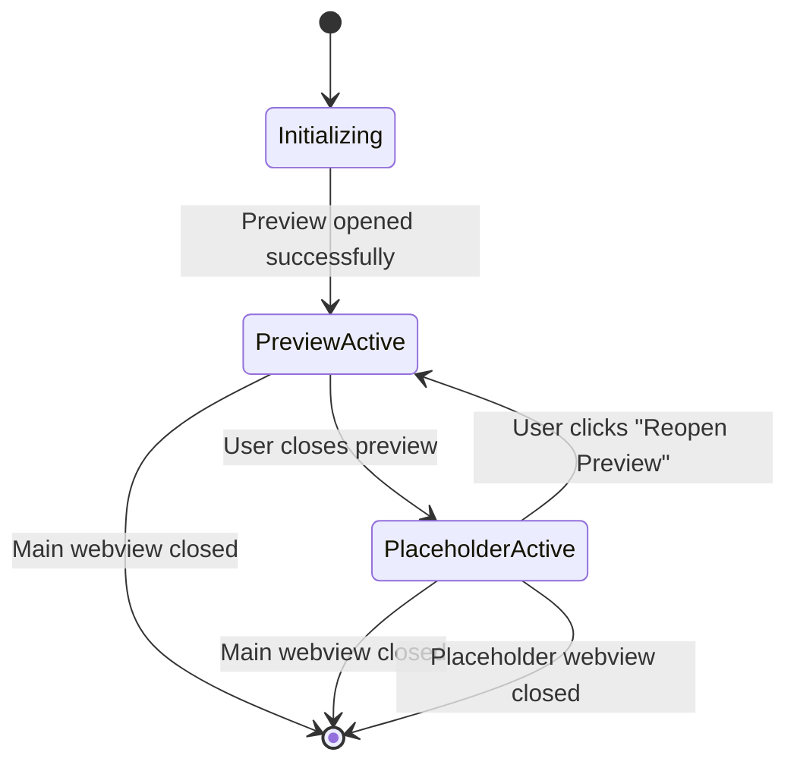

# 设计文档

## 概述

占位符 Webview 增强功能引入了一个复杂的双 webview 架构，在 Clotho clang-format 可视化编辑器中维持绝对的布局稳定性。该系统使用"哨兵"占位符 webview 来防止 VSCode 在代码预览关闭时折叠编辑器组，将潜在的错误状态转化为引导式用户体验。

## 架构

### 核心组件

```
┌─────────────────────────────────────────────────────────────────┐
│                    ClangFormatEditorCoordinator                  │
│                                                                 │
│  ┌─────────────────┐  ┌─────────────────┐  ┌─────────────────┐ │
│  │  EditorManager  │  │ PreviewManager  │  │PlaceholderMgr   │ │
│  │   (Main Panel)  │  │ (Code Preview)  │  │  (Sentinel)     │ │
│  └─────────────────┘  └─────────────────┘  └─────────────────┘ │
│           │                     │                     │        │
│           └─────────────────────┼─────────────────────┘        │
│                                 │                              │
│  ┌──────────────────────────────▼─────────────────────────────┐ │
│  │                    EventBus                                │ │
│  │  • preview-closed                                          │ │
│  │  • placeholder-show-requested                              │ │
│  │  • placeholder-reopen-clicked                              │ │
│  │  • layout-stability-maintained                             │ │
│  └────────────────────────────────────────────────────────────┘ │
└─────────────────────────────────────────────────────────────────┘
                                │
                                ▼
                    ┌─────────────────────────┐
                    │    VSCode UI Layout     │
                    │                         │
                    │  ┌─────────────────────┐ │
                    │  │ ViewColumn.One      │ │ ← Main Config Panel
                    │  │ (Config Webview)    │ │
                    │  └─────────────────────┘ │
                    │                         │
                    │  ┌─────────────────────┐ │
                    │  │ ViewColumn.Two      │ │ ← Preview OR Placeholder
                    │  │ (Dynamic Content)   │ │
                    │  └─────────────────────┘ │
                    └─────────────────────────┘
```

### State Machine Design

The system operates as a finite state machine with three primary states:



## Components and Interfaces

### 1. PlaceholderWebviewManager

**Purpose**: Manages the lifecycle and behavior of placeholder webviews.

```typescript
interface PlaceholderWebviewManager extends BaseManager {
    // Core lifecycle methods
    createPlaceholder(position: vscode.ViewColumn): Promise<void>;
    disposePlaceholder(): void;
    
    // State management
    isPlaceholderActive(): boolean;
    getPlaceholderPanel(): vscode.WebviewPanel | undefined;
    
    // Event handlers
    handleReopenRequest(): Promise<void>;
    handlePlaceholderClosed(): void;
}
```

### 2. Enhanced PreviewManager

**Purpose**: Extended to work seamlessly with the placeholder system.

```typescript
interface EnhancedPreviewManager extends PreviewManager {
    // New methods for placeholder integration
    onPreviewClosed(): Promise<void>;
    restorePreviewFromPlaceholder(): Promise<void>;
    
    // Enhanced state tracking
    getPreviewState(): 'active' | 'closed' | 'transitioning';
}
```

### 3. PlaceholderWebviewContent

**Purpose**: Defines the structure and behavior of the placeholder interface.

```typescript
interface PlaceholderContent {
    // Visual elements
    characterImage: string;
    welcomeMessage: string;
    reopenButton: ButtonConfig;
    
    // Theme adaptation
    themeMode: 'light' | 'dark';
    colorScheme: PlaceholderColorScheme;
    
    // Interaction handlers
    onReopenClick: () => void;
    onClose: () => void;
}

interface PlaceholderColorScheme {
    background: string;
    foreground: string;
    accent: string;
    buttonBackground: string;
    buttonHover: string;
}
```

## Data Models

### PlaceholderState

```typescript
interface PlaceholderState {
    isActive: boolean;
    panel: vscode.WebviewPanel | undefined;
    createdAt: Date;
    position: vscode.ViewColumn;
    themeMode: 'light' | 'dark';
}
```

### LayoutStabilityTracker

```typescript
interface LayoutStabilityTracker {
    leftPanelWidth: number;
    rightPanelWidth: number;
    lastTransition: Date;
    transitionCount: number;
    stabilityScore: number; // 0-100, higher is better
}
```

## Error Handling

### Error Recovery Strategy

1. **Placeholder Creation Failure**
   - Log error with context
   - Attempt to create minimal fallback placeholder
   - If fallback fails, gracefully degrade to single-panel mode
   - Notify user with non-intrusive message

2. **Webview Communication Errors**
   - Implement retry mechanism with exponential backoff
   - Maximum 3 retry attempts
   - Fallback to direct VSCode API calls if messaging fails

3. **Resource Loading Failures**
   - Use embedded base64 images as fallback
   - Provide text-only interface if all graphics fail
   - Maintain core functionality regardless of visual elements

### Error Types and Handlers

```typescript
enum PlaceholderErrorType {
    CREATION_FAILED = 'placeholder-creation-failed',
    COMMUNICATION_ERROR = 'placeholder-communication-error',
    RESOURCE_LOAD_ERROR = 'placeholder-resource-load-error',
    THEME_DETECTION_ERROR = 'placeholder-theme-detection-error'
}

interface PlaceholderErrorHandler {
    handleError(type: PlaceholderErrorType, error: Error, context: any): Promise<void>;
    attemptRecovery(type: PlaceholderErrorType): Promise<boolean>;
    reportError(type: PlaceholderErrorType, error: Error): void;
}
```

## Testing Strategy

### Unit Tests

1. **PlaceholderWebviewManager Tests**
   - Placeholder creation and disposal
   - State transitions
   - Event handling
   - Error scenarios

2. **Layout Stability Tests**
   - Measure panel dimensions before/after transitions
   - Verify no unexpected layout changes
   - Test rapid open/close scenarios

3. **Resource Management Tests**
   - Memory usage monitoring
   - Proper cleanup verification
   - Multiple instance handling

### Integration Tests

1. **End-to-End Workflow Tests**
   - Complete user journey from editor open to close
   - Preview close → placeholder show → preview restore
   - Error recovery scenarios

2. **VSCode API Integration Tests**
   - Webview creation and management
   - Theme change handling
   - Extension lifecycle integration

### Performance Tests

1. **Resource Usage Benchmarks**
   - Memory consumption limits (< 10MB per placeholder)
   - CPU usage monitoring (should be negligible when idle)
   - Load time measurements (< 200ms target)

2. **Stress Tests**
   - Multiple rapid transitions
   - Multiple editor instances
   - Long-running sessions

## Implementation Phases

### Phase 1: Core Infrastructure
- Create PlaceholderWebviewManager
- Implement basic placeholder webview
- Add event bus integration
- Basic error handling

### Phase 2: Visual Enhancement
- Design and implement placeholder UI
- Add character graphics and animations
- Implement theme adaptation
- Polish user interactions

### Phase 3: Advanced Features
- Layout stability tracking
- Performance optimizations
- Advanced error recovery
- Comprehensive testing

### Phase 4: Integration and Polish
- Full integration with existing codebase
- User experience refinements
- Documentation and examples
- Performance tuning

## Security Considerations

### Content Security Policy

The placeholder webview will use a strict CSP to prevent security vulnerabilities:

```html
<meta http-equiv="Content-Security-Policy" content="
    default-src 'none';
    style-src 'nonce-{nonce}' 'unsafe-inline';
    script-src 'nonce-{nonce}';
    img-src data: 'self';
    font-src 'self';
">
```

### Resource Validation

- All embedded resources will be validated
- No external network requests
- Sanitized user input handling
- Secure message passing between webviews

## Accessibility

### WCAG Compliance

- Proper ARIA labels for all interactive elements
- Keyboard navigation support
- High contrast mode compatibility
- Screen reader friendly content structure

### Internationalization

- Placeholder text will be localizable
- RTL language support
- Cultural considerations for character design
- Accessible color schemes for all themes