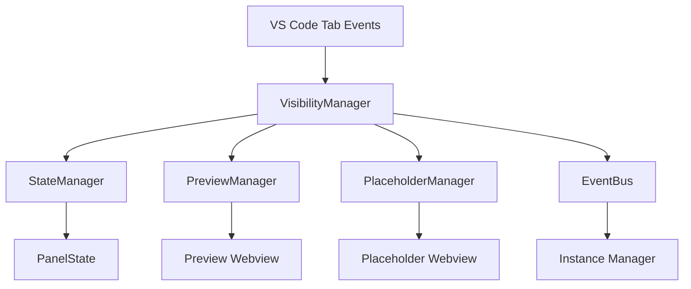
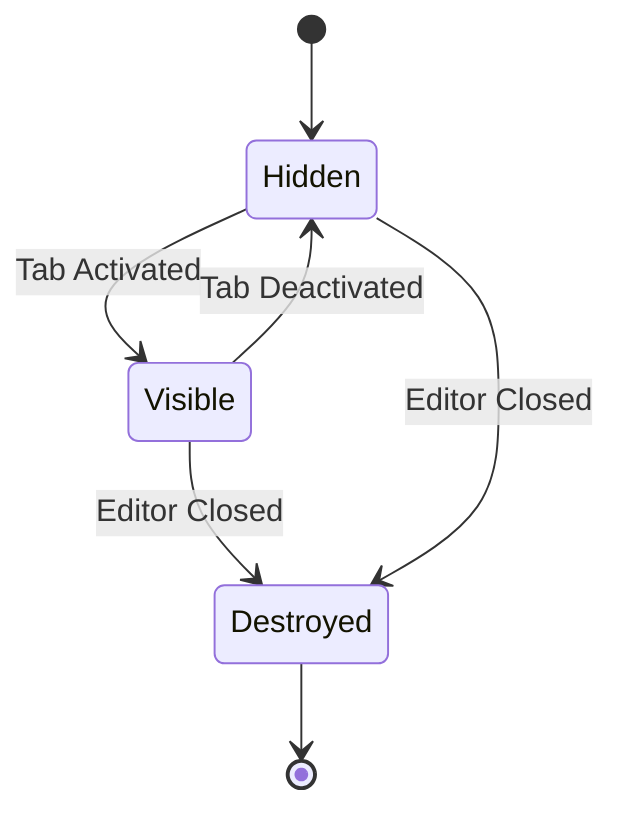

# Webview 可见性同步功能设计

## 概述

本设计实现 Clang-Format 可视化编辑器的主面板与右侧预览/占位符面板的可见性同步机制。通过监听 VS Code 的标签页状态变化事件，实现面板的智能显示、隐藏和销毁管理。

## 架构

### 核心组件关系



### 状态流转图



## 组件和接口

### 1. VisibilityManager (新增)

负责监听标签页状态变化并协调面板的显示/隐藏。

```typescript
interface VisibilityManager extends BaseManager {
    // 监听标签页激活事件
    onTabActivated(panel: vscode.WebviewPanel): void;
    
    // 监听标签页失活事件  
    onTabDeactivated(panel: vscode.WebviewPanel): void;
    
    // 监听编辑器关闭事件
    onEditorClosed(): void;
    
    // 获取当前可见性状态
    getVisibilityState(): VisibilityState;
}

interface VisibilityState {
    isMainPanelVisible: boolean;
    rightPanelType: 'preview' | 'placeholder' | 'none';
    rightPanelVisible: boolean;
    lastActiveTime: Date;
}
```

### 2. 增强的 StateManager

扩展现有状态管理器以支持可见性状态。

```typescript
interface EnhancedState extends ClangFormatEditorState {
    visibility: VisibilityState;
    panelHistory: PanelHistoryEntry[];
}

interface PanelHistoryEntry {
    type: 'preview' | 'placeholder';
    timestamp: Date;
    config?: any; // 保存面板配置以便恢复
}
```

### 3. 增强的 PreviewManager

添加显示/隐藏方法。

```typescript
interface EnhancedPreviewManager extends PreviewManager {
    // 隐藏预览面板（不销毁）
    hidePreview(): void;
    
    // 显示预览面板
    showPreview(): void;
    
    // 检查预览是否可见
    isPreviewVisible(): boolean;
}
```

### 4. 增强的 PlaceholderManager

添加显示/隐藏方法。

```typescript
interface EnhancedPlaceholderManager extends PlaceholderWebviewManager {
    // 隐藏占位符面板（不销毁）
    hidePlaceholder(): void;
    
    // 显示占位符面板  
    showPlaceholder(): void;
    
    // 检查占位符是否可见
    isPlaceholderVisible(): boolean;
}
```

## 数据模型

### PanelVisibilityState

```typescript
enum PanelVisibility {
    VISIBLE = 'visible',
    HIDDEN = 'hidden', 
    DESTROYED = 'destroyed'
}

interface PanelVisibilityState {
    mainPanel: PanelVisibility;
    rightPanel: PanelVisibility;
    rightPanelType: 'preview' | 'placeholder' | null;
    transitionInProgress: boolean;
}
```

### VisibilityTransition

```typescript
interface VisibilityTransition {
    from: PanelVisibilityState;
    to: PanelVisibilityState;
    trigger: 'tab-activated' | 'tab-deactivated' | 'editor-closed';
    timestamp: Date;
}
```

## 错误处理

### 错误类型

1. **TabEventError**: 标签页事件处理失败
2. **PanelStateError**: 面板状态同步失败  
3. **VisibilityTransitionError**: 可见性切换失败

### 错误恢复策略

```typescript
interface ErrorRecoveryStrategy {
    // 状态不一致时的恢复
    recoverFromStateInconsistency(): Promise<void>;
    
    // 面板丢失时的重建
    rebuildLostPanel(type: 'preview' | 'placeholder'): Promise<void>;
    
    // 事件监听器失效时的重新注册
    reregisterEventListeners(): void;
}
```

## 测试策略

### 单元测试

1. **VisibilityManager 测试**
   - 标签页激活/失活事件处理
   - 状态转换逻辑
   - 错误处理机制

2. **面板管理器增强功能测试**
   - 显示/隐藏方法
   - 状态查询方法
   - 面板恢复逻辑

### 集成测试

1. **端到端可见性同步测试**
   - 标签页切换场景
   - 编辑器关闭场景
   - 多实例并发场景

2. **性能测试**
   - 频繁切换响应时间
   - 内存使用情况
   - 资源清理验证

### 用户场景测试

1. **正常使用流程**
   - 打开编辑器 → 切换标签页 → 切回 → 关闭
   - 预览模式和占位符模式的切换

2. **异常场景**
   - VS Code 意外关闭
   - 面板手动关闭
   - 网络连接问题

## 实现细节

### 事件监听机制

```typescript
class VisibilityManager {
    private setupEventListeners(): void {
        // 监听标签页状态变化
        vscode.window.onDidChangeActiveTextEditor(this.handleEditorChange);
        vscode.window.onDidChangeVisibleTextEditors(this.handleVisibilityChange);
        
        // 监听 webview 面板状态
        this.context.eventBus.on('panel-activated', this.handlePanelActivated);
        this.context.eventBus.on('panel-deactivated', this.handlePanelDeactivated);
    }
}
```

### 状态同步机制

```typescript
class StateSync {
    async syncVisibility(newState: VisibilityState): Promise<void> {
        const currentState = this.stateManager.getVisibilityState();
        const transition = this.calculateTransition(currentState, newState);
        
        await this.executeTransition(transition);
        await this.stateManager.updateVisibilityState(newState);
    }
}
```

### 性能优化

1. **防抖机制**: 避免频繁切换时的重复操作
2. **延迟加载**: 面板内容在真正需要时才加载
3. **资源池**: 复用已创建的面板实例
4. **智能更新**: 只在面板可见时进行内容更新

## 配置选项

```typescript
interface VisibilityConfig {
    // 自动隐藏延迟（毫秒）
    autoHideDelay: number;
    
    // 自动显示延迟（毫秒）  
    autoShowDelay: number;
    
    // 是否启用可见性同步
    enableVisibilitySync: boolean;
    
    // 面板恢复策略
    panelRestoreStrategy: 'immediate' | 'lazy' | 'manual';
}
```

这个设计确保了面板可见性的智能同步，提供流畅的用户体验，同时保持良好的性能和资源管理。